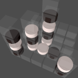
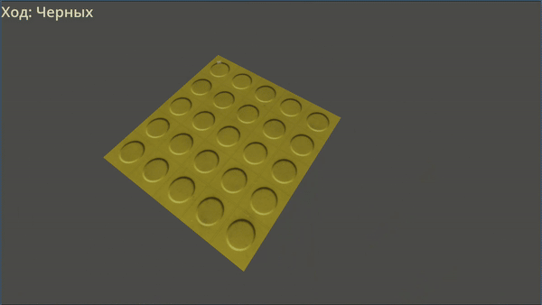
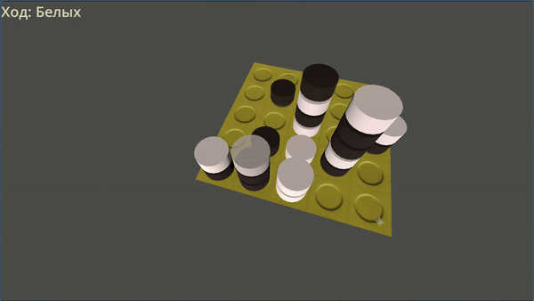

# 4 in row 3D 5x5x5





Это реализация трехмерной игры "Четыре в ряд" (по аналогии с настольной игрой Giiker Smart Four) на игровом движке Godot. Доска имеет размер 5x5x5, и цель игры — собрать четыре фишки подряд в любом направлении (горизонтальном, вертикальном, плоскостном или пространственном диагональном).

## Основные Функции

* **3D-Сетка 5x5x5:** Динамическая генерация игрового поля.
* **Игровая Логика:** Обработка кликов мышью для размещения фишек.
* **Проверка Победы:** Реализован алгоритм проверки 4-в-ряд по всем 49 направлениям в 3D-пространстве.
* **Режим 2-х Игроков:** Локальная игра с переключением хода.
* **Искусственный Интеллект (AI):** (В разработке) Планируется реализация Minimax с Alpha-Beta Pruning.

## Технологии

* **Игровой Движок:** Godot Engine (версия 5.1)
* **Язык:** GDScript

## 💻 Установка и Запуск

1.  **Клонирование Репозитория:**
    

    ```bash
    git clone https://github.com/abazhutov/4-in-row-3D.git
    cd 4-in-row-3D
    ```
2.  **Запуск в Godot:**
    * Скачайте по ссылке https://godotengine.org/download/
    * Откройте Godot Engine.
    * Нажмите **"Импортировать" (Import)** и выберите клонированный каталог.
    * Запустите главную сцену (`main.tscn`).

## ⚙️ Структура Проекта

| Файл / Папка | Описание |
| :--- | :--- |
| `res://main.tscn` | Главная сцена, содержащая корневой `GameManager`. |
| `res://gameManager.gd` | **Контроллер и Модель Игры.** Хранит состояние доски (`board_state`), управляет ходами, переключением игроков и проверкой победы. |
| `res://cell.tscn` / `res://cell.gd` | Сцена, представляющая одну позицию на доске (Area3D). Отвечает за обнаружение кликов и передачу координат `GameManager`. |
| `res://piece.tscn` | Сцена 3D-модели фишки (MeshInstance3D). |
| `res://Materials/` | Материалы для фишек и доски (`darkMaterial.tres`, `lightMaterial.tres`). |
<!-- | `res://Assets/` | 3D-модели, текстуры, шрифты. | -->

## 🕹️ Руководство по Игре

* **Камера:** Поворачивайте камеру с помощью клавиш cредней кнопки мыши, zoom - колёсико мыши, 
* **Размещение Фишки:** Нажмите **левой кнопкой мыши** на любую свободную ячейку в 3D-сетке 5x5x5.
* **Победа:** Первый игрок, собравший 4 фишки подряд по любой оси, побеждает.

---

## 🤝 Вклад в Проект

Приветствуются любые вклады и предложения по улучшению!

1.  Сделайте форк (Fork) этого репозитория.
2.  Создайте ветку для новой функции (`git checkout -b feature/AmazingFeature`).
3.  Зафиксируйте свои изменения (`git commit -m 'Add some AmazingFeature'`).
4.  Отправьте ветку (`git push origin feature/AmazingFeature`).
5.  Откройте Pull Request.

## 📝 Лицензия

Распространяется под лицензией MIT. Подробнее смотрите в файле `LICENSE`.